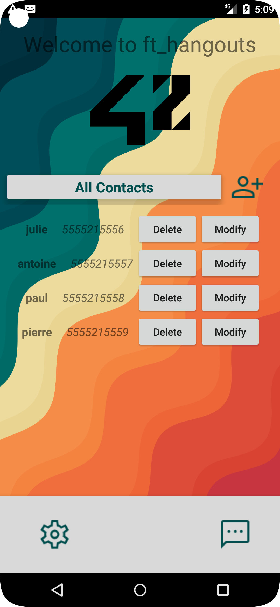
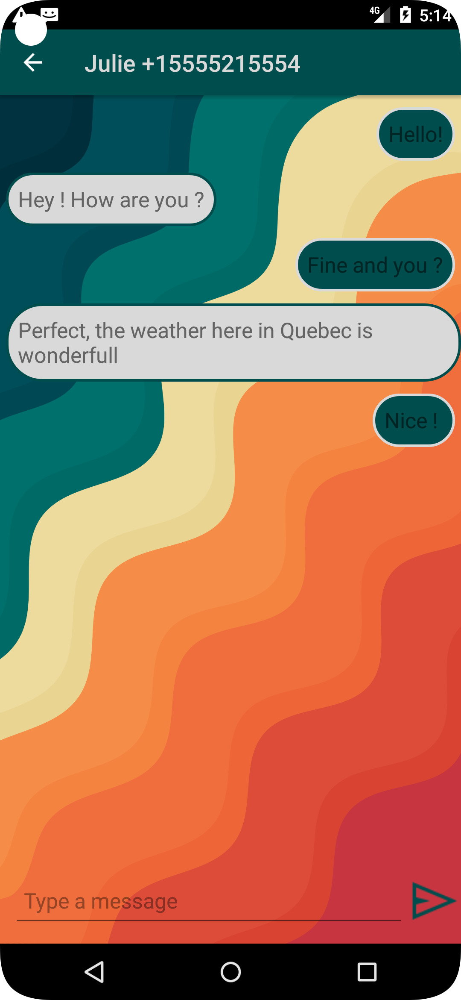

# ft_hangouts

## Subject 

•  Create a contact.
• Edit a contact.
• Delete a contact.
• Homepage with a summary for each contact.
• Receive text messages from recorded contacts.
• Send text messages to your contacts.
• Create a menu that will allow you to change the header color.
• The app will have to include two different languages.
• Show the time the app was set in the background when returning to the app.
• The app works in landscape and portrait modes.
• The app icon is the 42 logo.

## Today's appearance

  
  

