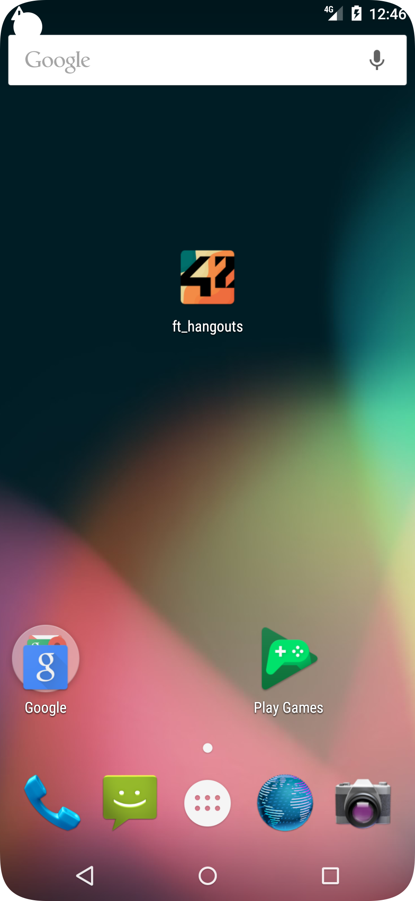
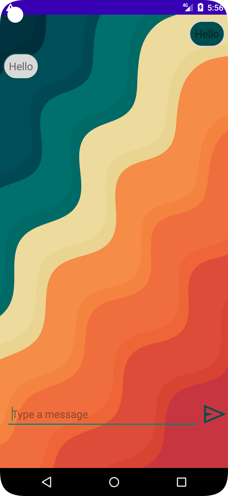

# ft_hangouts

## Subject 

*First project in Kotlin.*  

I have to fulfill various tasks that will help me understand how a mobile app
works. The goal is to make an app allowing to create a contact (containing at least 5
details), edit it and delete it. Once the contact is recorded, I will have to be able to
communicate with him through text messages.  

• Create a contact.  
• Edit a contact.  
• Delete a contact.  
• Homepage with a summary for each contact.  
• Receive text messages from recorded contacts.  
• Send text messages to your contacts.  
• Create a menu that will allow you to change the header color.  
• The app will have to include two different languages.  
• Show the time the app was set in the background when returning to the app.  
• The app works in landscape and portrait modes.  
• The app icon is the 42 logo.  

## Today's appearance

  
  
  
  

